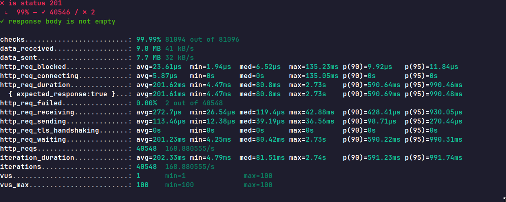

# Perf Testing

## Project Overview
`perf_testing` is a project designed to test and monitor the performance of an application using Docker Compose. The setup includes services for an application server, database, and monitoring tools like Prometheus and Grafana to visualize performance metrics. The project also includes Nginx as a reverse proxy and Postgres as the database.

## Demo 




## Prerequisites
- Docker
- Docker Compose

Make sure Docker and Docker Compose are installed on your system before proceeding.

## Project Structure
```bash
perf_testing/
├── db/                    # Directory to persist Postgres data
├── migrations/            # Directory to hold database migrations
├── cmd/                   # Directory to hold application logic
├── internal/              # Directory to hold database migrations
├── nginx.conf             # Nginx configuration
├── prometheus.yml         # Prometheus configuration
├── grafana-storage/       # Directory to persist Grafana data
├── .env                   # Environment variables for the application
├── Dockerfile             # Application Dockerfile
├── docker-compose.yml     # Docker Compose configuration
└── README.md              # Project documentation
```

## Run the project locally

1. **Clone the Repository**
   ```bash
   git clone https://github.com/Sarath191181208/perf_testing
   cd perf_testing
   ```

2. **Set up the Environment**
   Ensure the `.env` file is correctly configured with your environment variables for the app and database.
   look into [env.example](./.env.example)

3. **Build and Run the Docker Containers**
   Use Docker Compose to build and run the application and its associated services:
   ```bash
   docker-compose up 
   ```

4. **Access the Services**
   - **Nginx**: http://localhost:3000
   - **Prometheus**: http://localhost:9090
   - **Grafana**: http://localhost:9000 (username: `admin` /password: `admin`)

## License
This project is licensed under the MIT License.

## Contributions
Feel free to submit issues or pull requests to improve the project!

---

This should give you a clear start with your `perf_testing` project. You can adjust the services and configurations based on your specific testing requirements.
